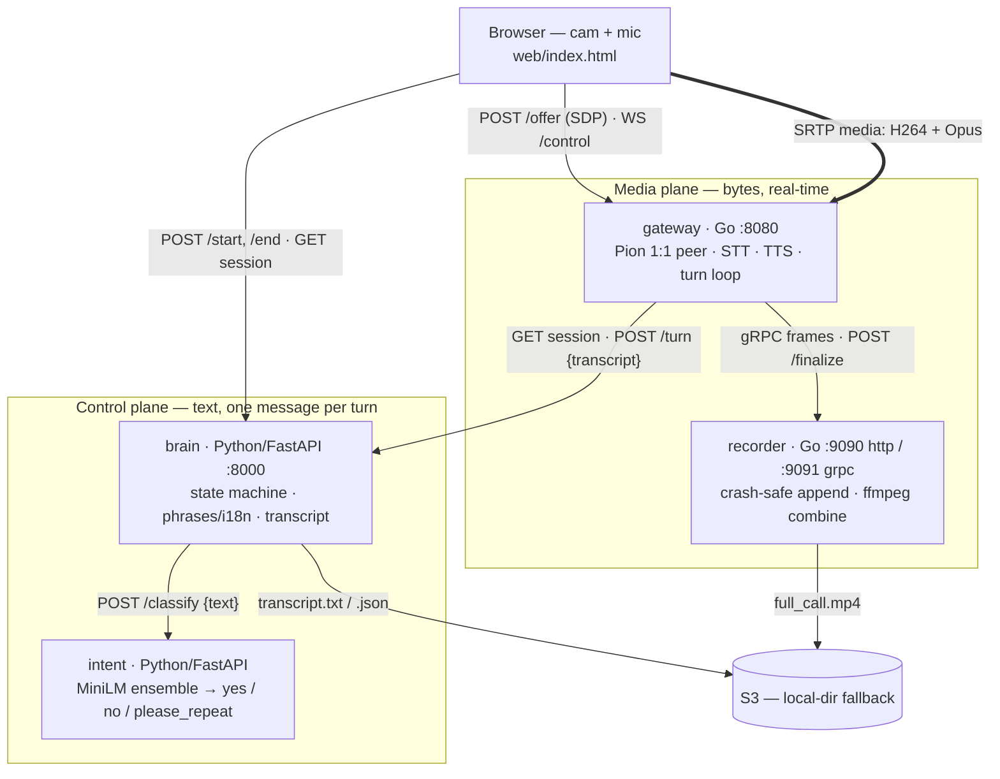
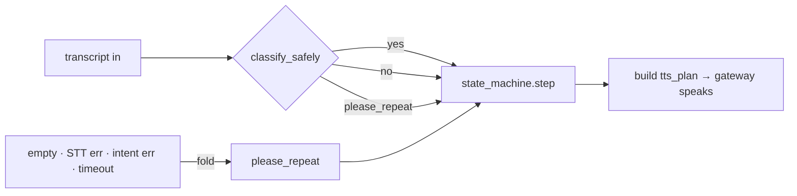

# VideoKYC

A Go + Python video-KYC server. One container holds **many concurrent calls**:
the media layer is Go (Pion WebRTC, no per-call GIL), while the consent flow,
phrase building, and intent model are kept verbatim from the original Python app.

This is **not an SFU**. Every call is one human + one bot — a 1:1 WebRTC
termination point with a recorder tap. No forwarding, no simulcast.

---

## Architecture

Four services split across two planes. The **control plane** makes decisions
(text, one message per turn); the **media plane** moves bytes (per-frame,
real-time). The only thing crossing between them is a transcript in and agent
text + a TTS plan out — once per turn.

- **brain** — Python/FastAPI control plane ([`brain/app/main.py`](brain/app/main.py)).
  Owns session state, the consent [`state_machine`](brain/app/services/state_machine.py),
  [`phrase`/i18n](brain/app/routes/sessions.py) building, and transcript artifacts.
  Never touches media.
- **intent** — Python/FastAPI classifier ([`intent/service.py`](intent/service.py),
  [`intent/classifier.py`](intent/classifier.py)), copied unchanged. A MiniLM
  encoder + a 3-way hard-vote ensemble → `yes` / `no` / `please_repeat`.
- **gateway** — Go media plane ([`cmd/gateway/main.go`](cmd/gateway/main.go)).
  Terminates the one [Pion peer](internal/gateway/peer), streams mic →
  [Sarvam STT](internal/gateway/stt), plays agent [ElevenLabs TTS](internal/gateway/tts),
  **drives the [turn loop](internal/gateway/turnloop)**, and tees media to the recorder.
- **recorder** — Go durable capture ([`cmd/recorder/main.go`](cmd/recorder/main.go),
  [`internal/recorder`](internal/recorder)). Receives tagged frames over
  [gRPC](proto/recorder.proto), appends to crash-safe files, runs one ffmpeg
  combine at finalize, uploads to S3.



### A call, end to end

`/start` builds the session and greeting in the brain; the browser then opens
the WebRTC peer against the gateway, which drives one classify→step→speak loop
per utterance and finalizes the recording on `/end`.

```mermaid
sequenceDiagram
    autonumber
    participant B as Browser
    participant Br as brain :8000
    participant G as gateway :8080
    participant I as intent
    participant R as recorder

    B->>Br: POST /api/v1/sessions/start {customer}
    Br-->>B: {session_id, agent_text, tts_plan, ice, gateway_offer_url}

    B->>G: POST /sessions/{id}/offer {sdp}
    G->>Br: GET /sessions/{id}  (language + greeting plan)
    G->>R: open gRPC RecordStream
    G-->>B: {sdp answer}
    B->>G: WS /sessions/{id}/control
    Note over B,G: SRTP media flows; greeting TTS plays

    loop one per utterance
        B->>G: mic audio (Opus/SRTP)
        G->>R: gRPC user PCM frames
        G->>Br: POST /sessions/{id}/turn {transcript}
        Br->>I: POST /classify {text}
        I-->>Br: {intent}
        Br-->>G: {agent_text, tts_plan, status}
        G->>R: gRPC agent PCM frames
        G-->>B: WS {final} / {agent_done} + agent audio
    end

    B->>Br: POST /api/v1/sessions/{id}/end
    Br->>G: POST /sessions/{id}/close
    G->>R: POST /finalize
    R-->>R: ffmpeg combine → S3
```

### The turn loop degrades, it never breaks

Any pipeline failure — empty transcript, STT error, intent error, timeout —
folds to `please_repeat`. The call asks the user to repeat; it does not crash.



### Repository layout

| Path | What |
|---|---|
| [`brain/`](brain) | Control plane: FastAPI app, state machine, phrases/i18n, transcripts |
| [`intent/`](intent) | Standalone classifier service (shared ~1.5 GB model) |
| [`cmd/gateway/`](cmd/gateway) · [`internal/gateway/`](internal/gateway) | Media plane: Pion peer, STT/TTS, turn loop |
| [`cmd/recorder/`](cmd/recorder) · [`internal/recorder/`](internal/recorder) | Durable capture, ffmpeg combine, S3 upload |
| [`proto/recorder.proto`](proto/recorder.proto) | gateway → recorder gRPC frame contract |
| [`web/index.html`](web/index.html) | Browser client (served by the gateway) |
| [`docker-compose.yml`](docker-compose.yml) | Single-box stack |
| [`docs/`](docs) | Architecture, contracts, per-service specs |

---

## Run it locally

### 0. Configure secrets

```bash
cp .env.example .env
```

For a localhost run you only need `SARVAM_API_KEY` and `ELEVENLABS_API_KEY`
(live STT/TTS). Leave the rest blank: S3 falls back to a local `./recordings`
dir, and TURN is only needed for NAT traversal in production.

### Option A — Docker Compose (recommended)

[`run.sh`](run.sh) bootstraps `.env`, builds, and starts the four services
(`coturn` is prod-only NAT traversal and is skipped):

```bash
./run.sh           # build + start (Ctrl-C to stop)
./run.sh logs      # follow logs
./run.sh down      # stop and remove the containers
```

Equivalent to `docker compose up --build intent brain recorder gateway`. Then
open **http://localhost:8080** (Chrome), allow camera + mic. The brain is
published on `:8000`, the gateway on `:8080`; `intent` and `recorder` talk
in-network.

### Option B — Native (no Docker, 4 terminals)

Prerequisites: **Go 1.26+**, **Python 3.12**, and **ffmpeg** on `PATH`
(`brew install go python@3.12 ffmpeg`).

**Terminal 1 — intent (`:8001`).** CPU-only torch is installed first so PyPI
never pulls the multi-GB CUDA build; the MiniLM encoder (~465 MB) downloads on
first run.

```bash
cd intent
python3.12 -m venv .venv && source .venv/bin/activate
pip install torch --index-url https://download.pytorch.org/whl/cpu
pip install -r requirements.txt
uvicorn service:app --port 8001
```

**Terminal 2 — brain (`:8000`).** Must be `:8000` — the web client hardcodes it.

```bash
cd brain
python3.12 -m venv .venv && source .venv/bin/activate
pip install -r requirements.txt
INTENT_SERVICE_URL=http://localhost:8001 uvicorn app.main:app --port 8000
```

**Terminal 3 — recorder (`:9090` http / `:9091` grpc).** From the repo root.
Defaults to `./recordings` and the local-dir fallback when AWS is unset.

```bash
go run ./cmd/recorder
```

**Terminal 4 — gateway (`:8080`).** From the repo root (it serves `web/` from the
working dir). Defaults already point at brain `:8000` and recorder `:9090/:9091`;
export the vendor keys it needs for live STT/TTS:

```bash
export SARVAM_API_KEY=...  ELEVENLABS_API_KEY=...
go run ./cmd/gateway
```

Open **http://localhost:8080** and allow camera + mic.

### Verify it's up

```bash
curl -s localhost:8000/health   # brain   → {"status":"ok"}
curl -s localhost:8001/health   # intent  → {"status":"ok"}   (native run only)
```

The recorder logs `recorder: HTTP on :9090` and `recorder: gRPC on :9091`; the
gateway logs `gateway listening on :8080`. Under Docker, `intent` and `recorder`
have no published host ports — check them via `docker compose logs`.

---

## Where to read more

`docs/ARCHITECTURE.md` (planes + packet paths), `docs/CONTRACTS.md` (every
inter-service contract), `docs/SETUP.md` (build wiring), and the per-service
specs: `docs/GATEWAY.md`, `docs/RECORDER.md`, [`brain/CLAUDE.md`](brain/CLAUDE.md),
[`intent/CLAUDE.md`](intent/CLAUDE.md).
